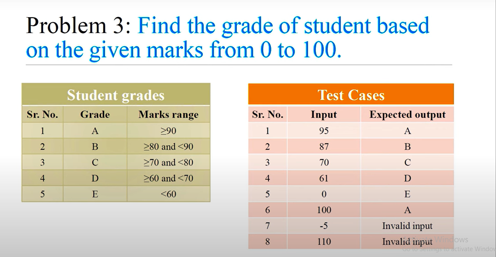

<!-- code block  -->

marks = int(input("Enter marks: "))

if marks < 0 or marks > 100:
    print("Invalid input")
elif marks >= 90:
    print("A")
elif marks >= 80:
    print("B")
elif marks >= 70:
    print("C")
elif marks >= 60:
    print("D")
else:
    print("E")