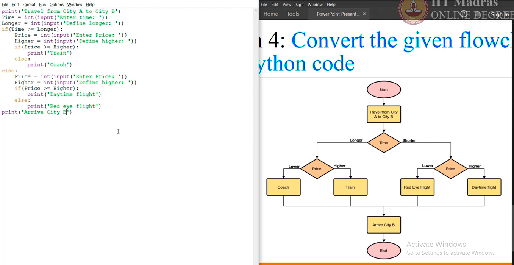

# try to understand the flowchart and write the code for the same

<!-- code block  -->

print("Travel from City A to City B")

time = int(input("Enter time: "))
longer = int(input("Define longer value: "))

if time >= longer:
    price = int(input("Enter price: "))
    higher = int(input("Define higher value: "))

    if price >= higher:
        print("Train")
    else:
        print("Coach")

else:
    price = int(input("Enter price: "))
    higher = int(input("Define higher value: "))

    if price >= higher:
        print("Daytime Flight")
    else:
        print("Red Eye Flight")

print("Arrive City B")