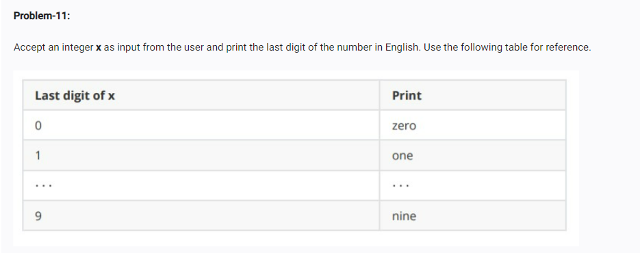

<!-- code: -->
<!-- x = int (input("enter a number :"))
last_num = x % 10 

words = ["zero", "one", "two", "three", "four",
         "five", "six", "seven", "eight", "nine"]

print(words[last_num]) -->
<!-- op -->
<!-- enter a number :199
nine -->