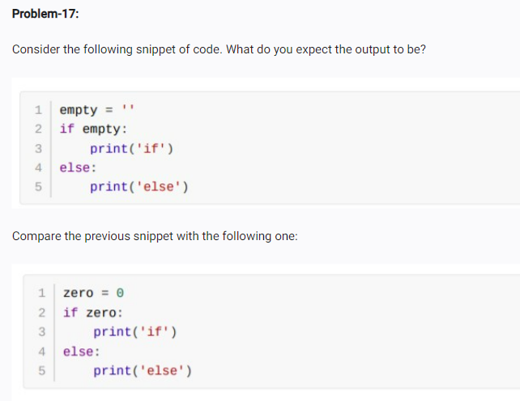

<!-- op: -->
 
<!-- Output:
else

Reason:
'' is a falsy value in Python. Therefore the condition `if empty:` evaluates to False, so the else block executes.
 -->

<!-- second code  -->

<!-- op: -->
<!-- output :
else

Reason :
0 is a falsy value in Python. Therefore the condition `if zero:` evaluates to False, so the else block executes. -->