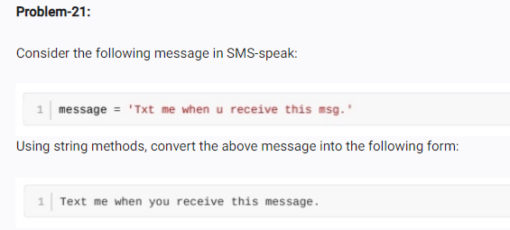

<!-- code: -->
message = 'Txt me when u receive this msg '

message = (message.replace("Txt","Text"))

message = (message.replace("u","you"))

message = (message.replace("msg","message"))

print(message)

<!-- op: -->
Text me when you receive this message 