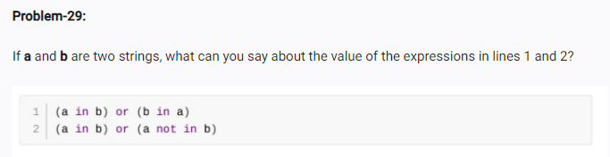

<!-- coed:-->

<!-- the first contidion will  whether return true or false but the second  conditiion always return true  -->

<!-- a ="cat"
b = "catnap"
print(a in b) or (b in a )

x = "sun"
y = "sunflower"
print(a in b ) or ( a not in b) -->
<!-- op: -->
<!-- True
True -->