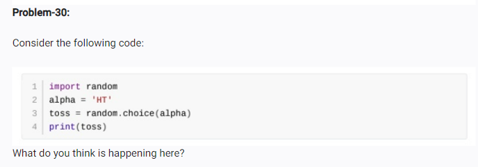

<!-- code: -->
<!-- import random 
alpha ='HI'
toss = random.choice(alpha)
print(toss) -->

<!-- op: -->
<!-- H -->
<!-- here this code sinppet uses random module and prints a radnom value inside the alpha varibale using choice function -->