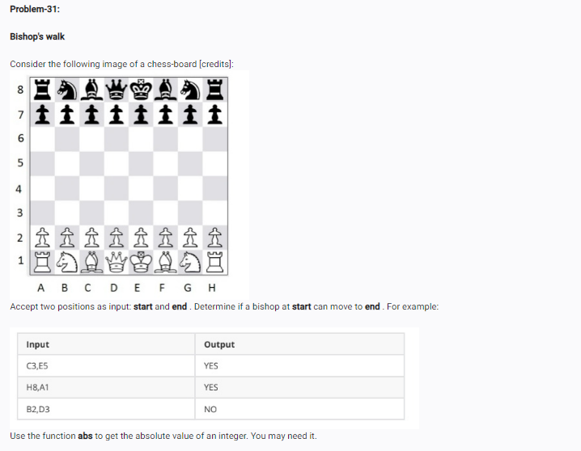

<!-- code: -->
<!-- # 1. Take inputs for the start and end positions
# Example input: "C3" and "E5"
start = input("Enter start position (like C3): ")
end = input("Enter end position (like E5): ")

# 2. Convert the column letters into numbers (A=1, B=2, ...)
# ord() helps convert letters to numbers. ord('A') is 65.
start_col = ord(start[0].upper()) - ord('A') + 1
end_col = ord(end[0].upper()) - ord('A') + 1

# 3. Get the row numbers
start_row = int(start[1])
end_row = int(end[1])

# 4. Calculate the distances using abs()
col_distance = abs(start_col - end_col)
row_distance = abs(start_row - end_row)

# 5. Check if they are equal
if col_distance == row_distance:
    print("YES")
else:
    print("NO")
 -->

 <!-- op: -->
 <!-- Enter start position (like C3): d4
Enter end position (like E5): f6
YES -->