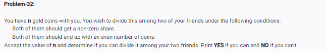

<!-- code: -->

<!-- # 1. Accept the number of coins
n = int(input("Enter the number of coins: "))

# 2. Check if n is greater than 2 AND is an even number
if n > 2 and n % 2 == 0:
    print("YES")
else:
    print("NO") -->

<!-- op: -->

<!-- Enter the number of coins: 6
YES -->

<!-- Enter the number of coins: 5
NO -->