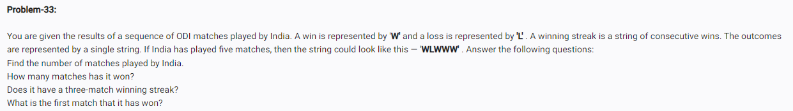

<!-- CODE: -->
<!-- odi = 'WLWWW'

# 1. Number of matches
print("Matches played:", len(odi))

# 2. Number of wins
print("Matches won:", odi.count('W'))

# 3. Check for 3-match streak
if 'WWW' in odi:
    print("Three-match winning streak? YES")
else:
    print("Three-match winning streak? NO")

# 4. First match won (add 1 because python starts at 0)
first_win = odi.find('W') + 1
print("First match won was match number:", first_win) -->

<!-- OP: -->
<!-- Matches played: 5
Matches won: 4
Three-match winning streak? YES
First match won was match number: 1 -->

