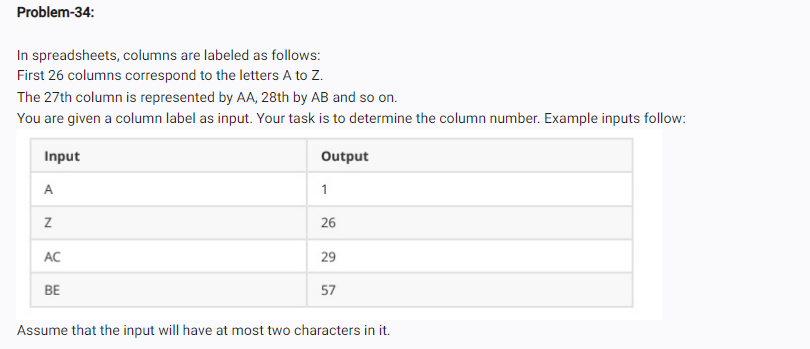

<!-- CODE:-->
<!-- label = input("Enter column label: ").upper()

# Check if the label is just 1 letter
if len(label) == 1:
    column_number = ord(label[0]) - ord('A') + 1

# Check if the label has 2 letters
elif len(label) == 2:
    first_val = ord(label[0]) - ord('A') + 1
    second_val = ord(label[1]) - ord('A') + 1
    
    # First letter counts for 26 units each
    column_number = (first_val * 26) + second_val

print("Output:", column_number) -->

<!-- op: -->
<!-- Enter column label: gr
Output: 200 -->