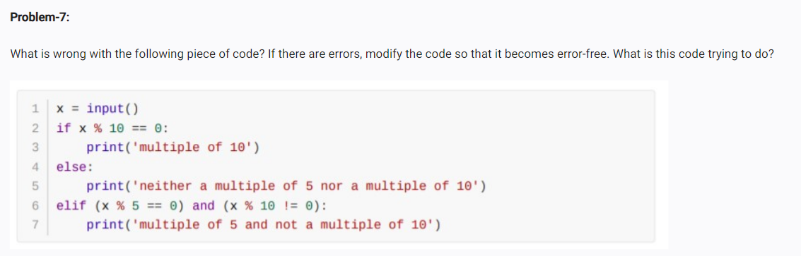

<!-- code: -->
<!-- x = int(input())
if x % 10 == 0:
    print('multipe of 10')
elif (x % 5 == 0) and (x % 10 != 0):
    print('multiple of 5 and not a multiple of 10 ')
else:
    print('neither a mltile of 5 nor a multiple of 10') -->

<!-- note:-->
<!-- there are two problems in this code input must be an int bcs input function returns a string and % opeartor only acts on int not on str and elif should come after if not  after else  that is te syntax if ,,elif,,else  -->