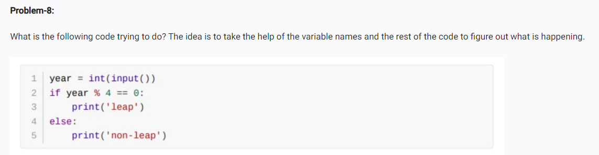

<!-- note: -->
<!-- the code is trying to find whether the input year is leap or not  -->
<!-- op: -->
<!-- year = 2026
non-leap -->
<!-- year = 2024 -->
<!-- leap -->
<!-- code: -->
<!-- year = int(input("enter a year":))
if year % 4 == 0:
   print("leap")
else:
print("non-leap") -->