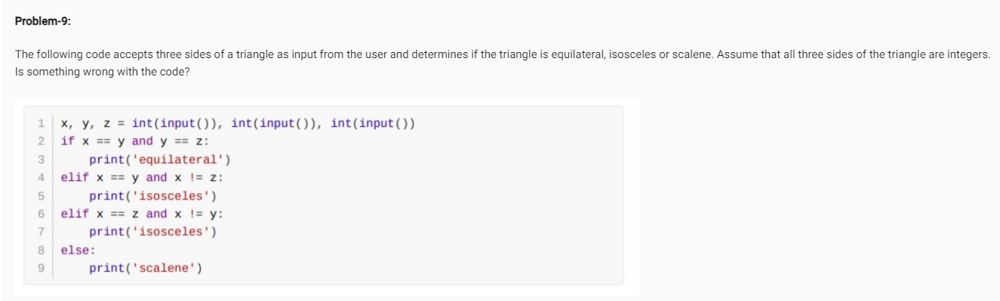

<!-- error  -->
<!-- to check whether then triangle is isosceles we need to check all the three values and find if there is any two equal values and one not equal value like x =y !=z conditions used here x == y and x!=Z naother was x ==z amd x!=y and must check another condition too y == z and y!=x so we can find whether it is isosceles or not  -->

<!-- code: -->
<!-- x,y,z =int(input()),int(input()),int(input())
if x == y and x == z :
   print("equilateral")
elif x ==y and x != z:
   print("isosceles")
elif x == z and x!= y:
   print("isosceles")
elif y == x and y!=z :
   print("isosceles")
else:
   print("scalene") -->
   

<!-- op: -->
<!-- 2
2
4
isosceles -->

<!-- 2
2
2
equilateral -->