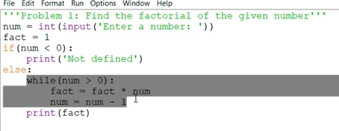
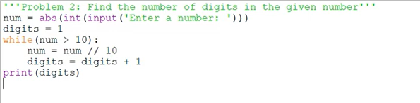
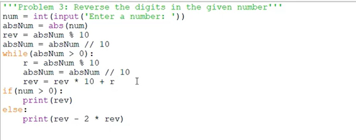

## convert the below while loop to a for loop code

```
<!-- problem 1 sln: -->
num = int(input('Enter a number:'))
fact = 1
if (num < 0):
    print("not defined")
else:
    for i in range (1,num+1):
        fact = fact * i
    print(fact)

```


```
<!-- problem 2 sln -->
num = str(abs(int(input('Enter a numhber:'))))
digits = 0
for ch in num :
    digits = digits + 1
print(digits)
```

```

num = int(input("Enter a number:"))
num_str = str(abs(num))
rev_str =''

for ch in num_str :
    rev_str=ch + rev_str

rev = int(rev_str)

if num <0 :
    ptint(-rev)
else:
    print(rev)

```