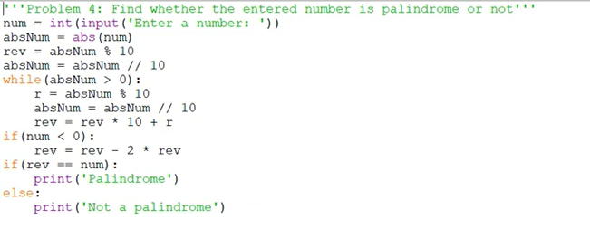

## Convert the code to equivalent for loop code

<!-- code: -->
<!--
 num = int(input("Enter a number:"))

num_str = str(abs(num))
rev_str = ""

for ch in num_str:
    rev_str = ch + rev_str

if num_str == rev_str:
    print("palindrome")
else:
    print('Not a palindrome') -->