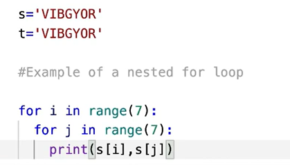

# find the output for the below code

<!-- code: -->
<!-- 
s ='VIBGYOR'
t ='VIBGYOR'

for i in range(7):
    for j in range(7):
        print(s[i],s[j])
 -->
<!-- op: -->
<!--
 V V
V I
V B
V G
V Y
V O
V R
I V
I I
I B
I G
I Y
I O
I R
B V
B I
B B
B G
B Y
B O
B R
G V
G I
G B
G G
G Y
G O
G R
Y V
Y I
Y B
Y G
Y Y
Y O
Y R
O V
O I
O B
O G
O Y
O O
O R
R V
R I
R B
R G
R Y
R O
R R -->