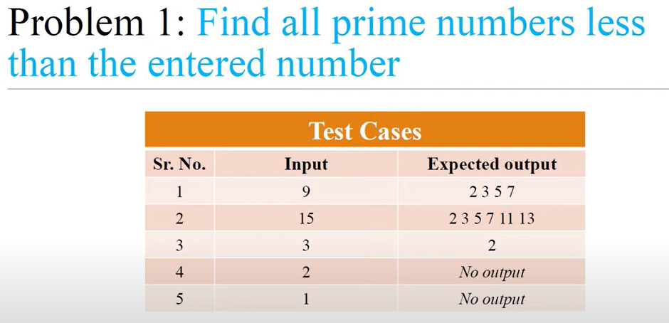

<!-- code: -->
<!-- 
limit = int(input("enter a number:"))

for num in range (2,limit):
    is_prime = True

    for i in range (2,num):
        if num % i == 0:
            is_prime = False
            break
    if is_prime:
        print(num,end=' ') -->

<!-- op: -->
<!-- enter a number:6
2 3 5  -->