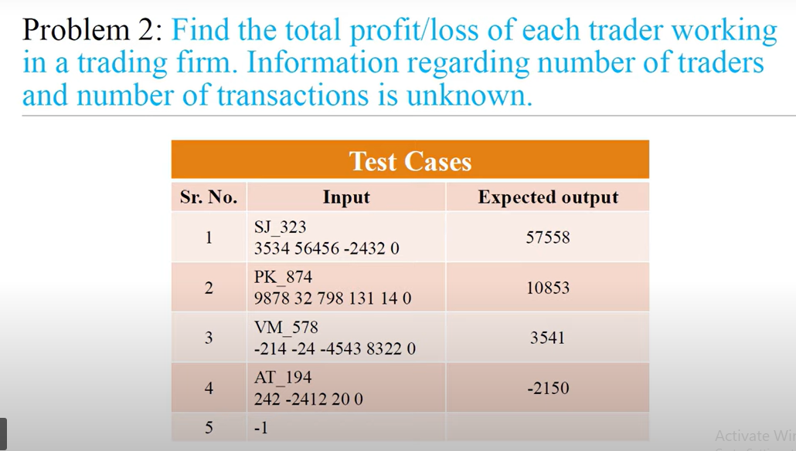

<!-- code: -->
<!-- 
while True:
    trader_id = input("Enter trader ID (or -1 to stop): ")
    
    if trader_id == "-1":
        break
        
    transactions = input("Enter transactions (end with 0): ").split()
    
    total_profit_loss = 0
    index = 0
    
    while index < len(transactions):
        amount = int(transactions[index])
        
        if amount == 0:
            break
            
        total_profit_loss = total_profit_loss + amount
        index = index + 1
        
    print(total_profit_loss)

 -->
