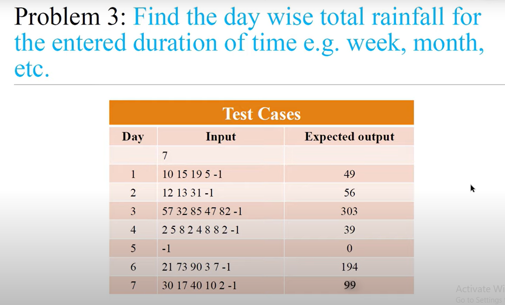

<!-- code:-->
<!-- 
total_days = int(input())

for day in range(1, total_days + 1):
    rainfall_inputs = input().split()
    total_rainfall = 0
    index = 0
    
    while index < len(rainfall_inputs):
        amount = int(rainfall_inputs[index])
        
        if amount == -1:
            break
            
        total_rainfall = total_rainfall + amount
        index = index + 1
        
    print(total_rainfall) -->
