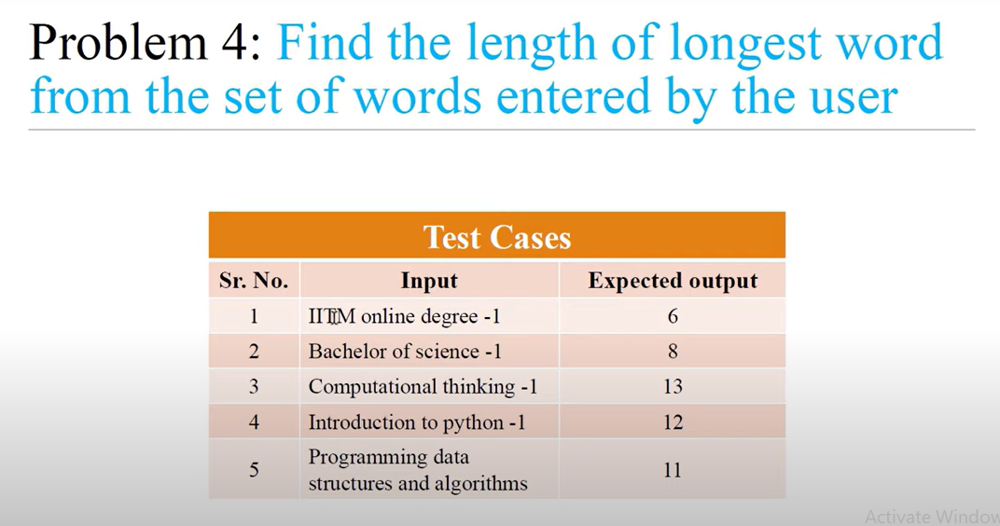

<!-- code:-->
<!-- 
words = input().split()
max_length = 0 

for current_word in words :
    if current_word == "-1":
        break

    word_len = len(current_word)

    if word_len > max_length :
        max_length = word_len
print(max_length) -->

<!-- op: -->
<!-- 
i am hari -1 
4 
-->