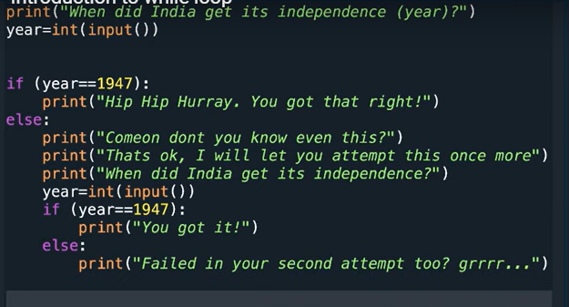

# Type the output below



<!-- code: -->
<!-- print("When did india got its independence (year)?")
year = int (input())

if (year == 1947):
    print("Hip hip hurry. You got that right!")

else:
    print("comon dont u know this ?")
    print("thast ok i will let you attempt again this once more ")
    print("When did india get its independence?")
    year = int(input())
    if (year == 1947):
        print("you got it ")
    else:
        print("you failed on second attempt") -->

## TestCase 1
input=1940
```
When did india got its independence (year)?
1940
comon dont u know this ?
thast ok i will let you attempt again this once more
When did india get its independence?


```

## TestCase 2
input=1947
```
When did india got its independence (year)?
1940
comon dont u know this ?
thast ok i will let you attempt again this once more
When did india get its independence?
1947
you got it 


```
