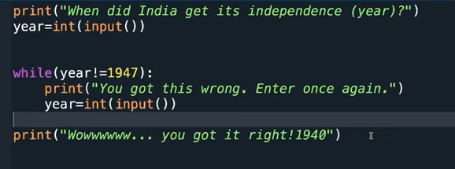

## Predict the output


## TestCase 1
- input 1 : 1900
- input 2 : 2021
- input 3 : 1937
- input 4 : 1947
```

When did India get independance (year)?
1900
you got this wrong. Enter once again.
2021
you got this wrong. Enter once again.
1937
you got this wrong. Enter once again.
1947
Wowwwww... you got it right!1940


```

