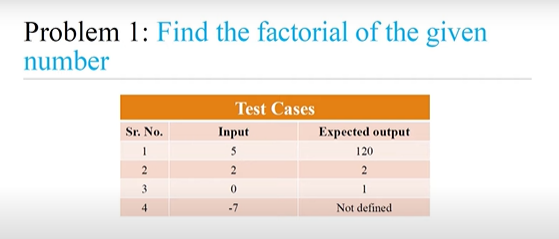

<!-- code: -->
<!-- # code:

n = int(input("Enter a number: "))

 
factorial = 1

if n > 0 :
    for i in range(1, n + 1):
        factorial = factorial * i
    print("The factorial is:", factorial)

else:
    print("not defined ")

 -->