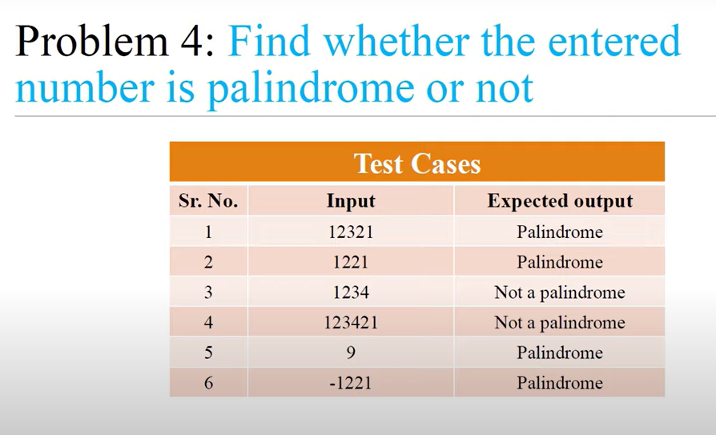

<!-- code: -->

<!-- 
n = input("Enter a number:")

if n.startswith('-'):
    clean_n = n[1]
else:
    clean_n = n

if clean_n  == clean_n[::-1] :
    print("palindrome")
else:
    print("not a palindrome") -->