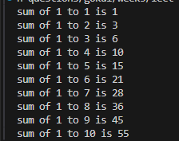

## write a python program to get the below output

<!-- code: -->

<!-- n = int(input("Enter the number u want to sum:"))

total_sum = 0

for i in range (1, n + 1):
    total_sum +=i
    print("sum of 1 to",i,"is", total_sum) -->

<!-- op: -->
<!-- Enter the number u want to sum:10
sum of 1 to 1 is 1
sum of 1 to 2 is 3
sum of 1 to 3 is 6
sum of 1 to 4 is 10
sum of 1 to 5 is 15
sum of 1 to 6 is 21
sum of 1 to 7 is 28
sum of 1 to 8 is 36
sum of 1 to 9 is 45
sum of 1 to 10 is 55 -->