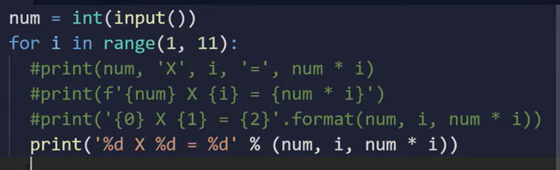

# rewrite the 4 different ways of formatted printing

- also what is the meaning of %d here?
<!-- %d means: 
  %d acts as a placeholder.It stands for a whole number.It cannot hold numbers with decimals.The letter d means decimal integer.It tells Python to print a number.-->