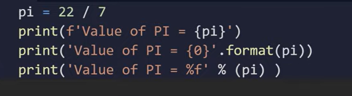

# write the code to get the output rounded off to 2,3,4 decimal point

<!-- code: -->
<!-- pi = 22 / 7 
print(f'vaue of pi ={pi:.2f}')
print('valur of pi = {0:.3f}'.format(pi))
print('value of pi =%.4f' % (pi)) -->

<!-- op: -->
<!-- 
vaue of pi =3.14
valur of pi = 3.143
value of pi =3.1429 -->