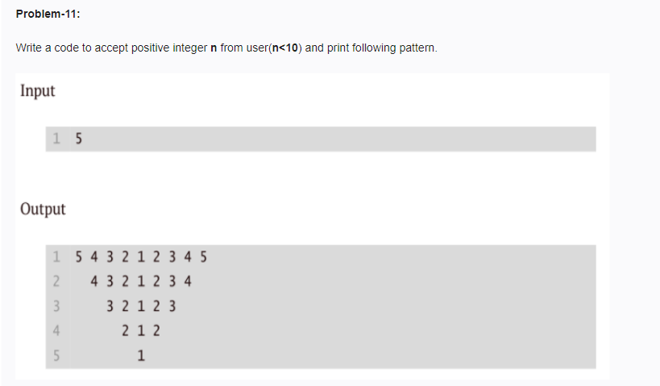

<!-- code: -->
<!-- 
n = int(input())

if n < 10:
    for row in range(n, 0, -1):
        row_nums = []

        for num in range(row, 0, -1):
            row_nums.append(str(num))

        for num in range(2, row + 1):
            row_nums.append(str(num))

        spaces = " " * (2 * (n - row))
        print(spaces + " ".join(row_nums))
 -->