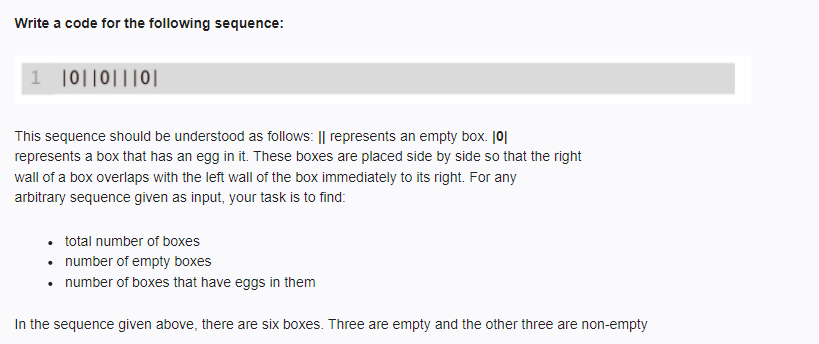

<!-- code: -->
<!-- 
def count_boxes(sequence):
    total_bars = sequence.count('|')
    egg_boxes = sequence.count('0')
    
    total_boxes = total_bars - 1
    empty_boxes = total_boxes - egg_boxes
    
    return {
        "total_boxes": total_boxes,
        "empty_boxes": empty_boxes,
        "egg_boxes": egg_boxes
    }

sequence = "|0||0|||0|"
results = count_boxes(sequence)

print(f"Total number of boxes: {results['total_boxes']}")
print(f"Number of empty boxes: {results['empty_boxes']}")
print(f"Number of boxes that have eggs in them: {results['egg_boxes']}") -->

<!-- op: -->
<!-- Total number of boxes: 6
Number of empty boxes: 3
Number of boxes that have eggs in them: 3 -->