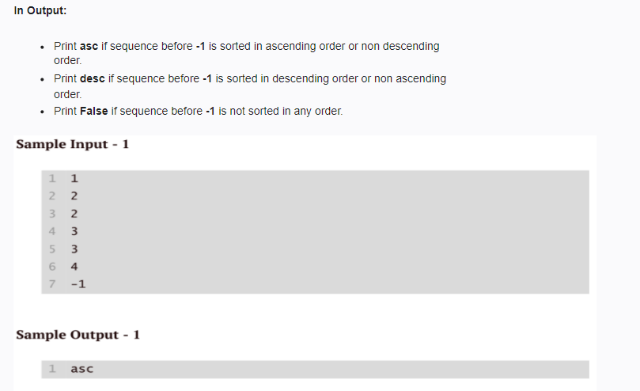
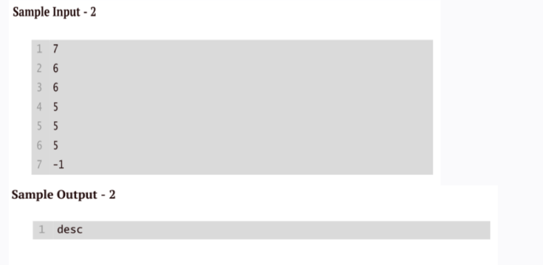
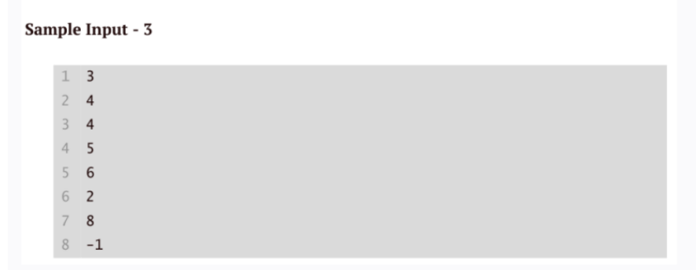

Write a code to accept the sequence of positive integers ending with -1 and at least two distinct integers
must be before -1.

<!-- code: -->
<!--
 is_asc = True
is_desc = True

prev = int(input())
num = int(input())

while num != -1:
    if num > prev:
        is_desc = False
    elif num < prev:
        is_asc = False
        
    prev = num
    num = int(input())

if is_asc and not is_desc:
    print("asc")
elif is_desc and not is_asc:
    print("desc")
else:
    print("False") -->
