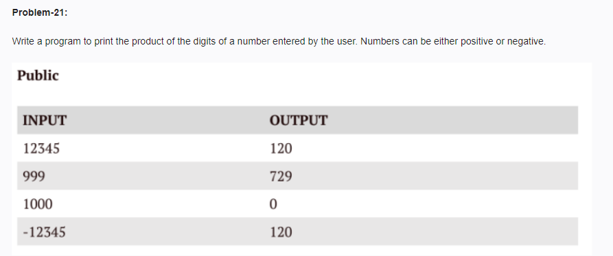

<!-- code: -->
<!-- 
num_str = input()

if num_str.startswith('-'):
    num_str = num_str[1:]

product = 1

for digit in num_str:
    product *= int(digit)

print(product) -->
<!-- op: -->
<!-- 12345
120 -->
