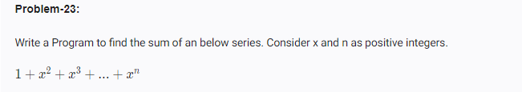

<!-- code: -->
<!--
 x = int(input("enter the value of x:"))
n = int(input("enter the value of n:"))

series_sum = 1 
for i in range(2 , n + 1):
    series_sum += x ** i
print(series_sum) -->
<!-- op: -->
<!-- 
enter the value of x:2
enter the value of n:4
29 -->