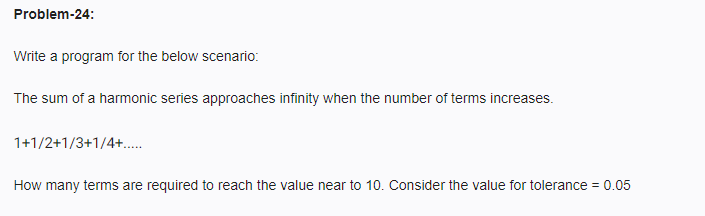

<!-- code: -->
<!-- 
target = 10.0
tolerance = 0.05
current_sum = 0.0
terms = 0

while (target - current_sum) > tolerance:
    terms += 1
    current_sum += 1 / terms

print(terms)
print(current_sum) -->
<!-- op: -->
<!--
 11764
9.950057466523377 -->