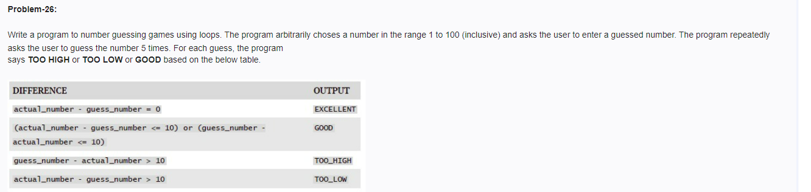

<!-- code: -->
<!--
 import random

actual_number = random.randint(1, 100)

for attempt in range(5):
    guess_number = int(input())
    
    if guess_number == actual_number:
        print("EXCELLENT")
        break
    elif guess_number - actual_number > 10:
        print("TOO_HIGH")
    elif actual_number - guess_number > 10:
        print("TOO_LOW")
    else:
        print("GOOD") -->
