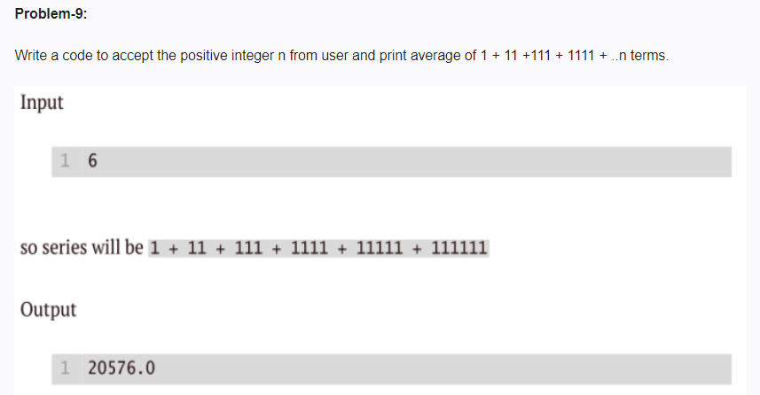

<!-- code: -->
<!--
 n = int(input("enetr a number:"))
total_sum = 0
current_term = 0 

for i in range (1,n + 1):
    current_term = current_term * 10 + 1
    total_sum = total_sum + current_term
average = total_sum / n
print(average)
 -->
 <!-- op: -->
 <!-- 
 enetr a number:5
2469.0 -->